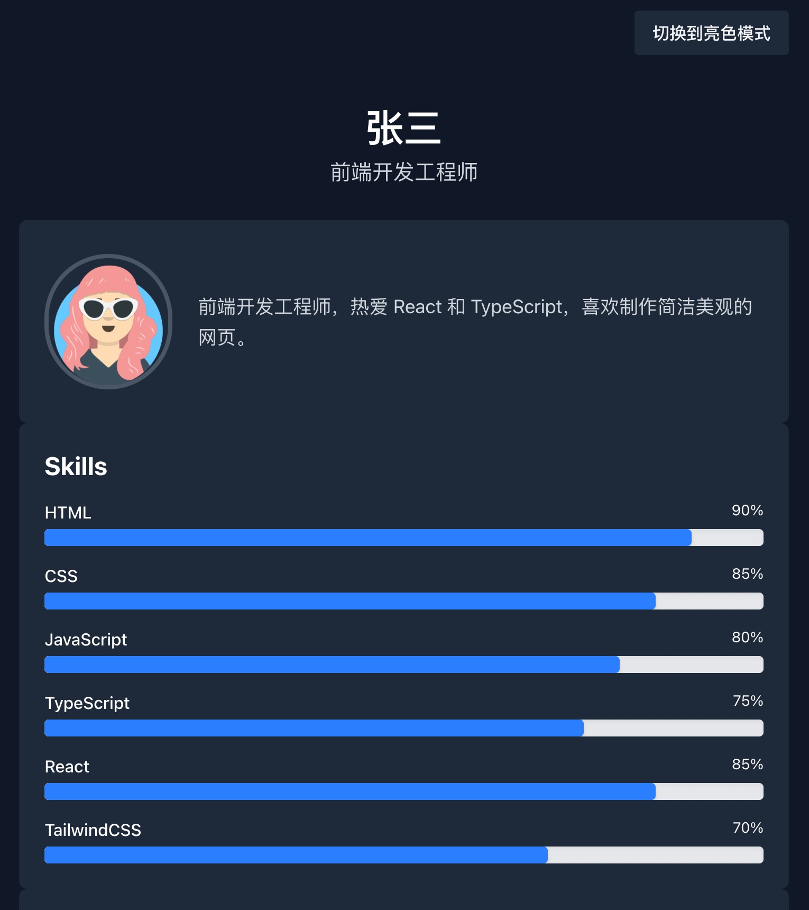

# 个人简历网站 - React + TypeScript + TailwindCSS



<div align="center">
  
  [](https://reactfolio-sooty.vercel.app/)
  [](https://github.com/Mydykitty/reactfolio)

</div>

## ✨ 在线体验

👉 **[点击查看在线 Demo](https://reactfolio-sooty.vercel.app/)**

## 🎯 项目亮点

- ⚡ **Vite + React** - 极速开发体验
- 📘 **TypeScript** - 类型安全，减少bug
- 🌓 **深色模式** - 支持系统主题跟随，手动切换
- 📱 **响应式设计** - 手机/平板/桌面完美适配
- 🎨 **TailwindCSS** - 原子化CSS，开发效率++

## 🛠️ 技术栈

- **前端框架**: React 18
- **语言**: TypeScript
- **样式**: TailwindCSS
- **构建工具**: Vite
- **代码规范**: ESLint + Prettier

## 🚀 快速开始

```bash
# 克隆项目
git clone https://github.com/Mydykitty/reactfolio.git

# 安装依赖
npm install

# 开发环境
npm run dev

# 生产构建
npm run build

# 本地可参考命令
Cmd + Shift + P → TypeScript: Restart TS Server

npm install react-intersection-observer

npm install -D @vitejs/plugin-vue tailwindcss postcss autoprefixer

npx tailwindcss init

npm install framer-motion

npm install @supabase/supabase-js

npm install zustand

npm install react-markdown remark-gfm rehype-raw

npm install -D @tailwindcss/typography

npm install react-syntax-highlighter
npm install --save-dev @types/react-syntax-highlighter

npm install recharts

# 头像上传和编辑组件
npm install react-avatar-editor

# 如果需要图片压缩
npm install browser-image-compression

npm install --save-dev @types/react

npm install react-wordcloud

npm install d3 d3-cloud

npm install --save-dev @types/d3 @types/d3-cloud


Settings/Developer settings/ReactFolio

Homepage URL：
  本地部署：http://localhost:5173
  线上部署：https://reactfolio-sooty.vercel.app/

```

## 🚧 开发计划

基础简历展示

深色模式切换

滚动动画效果

博客模块

多语言支持

单元测试
